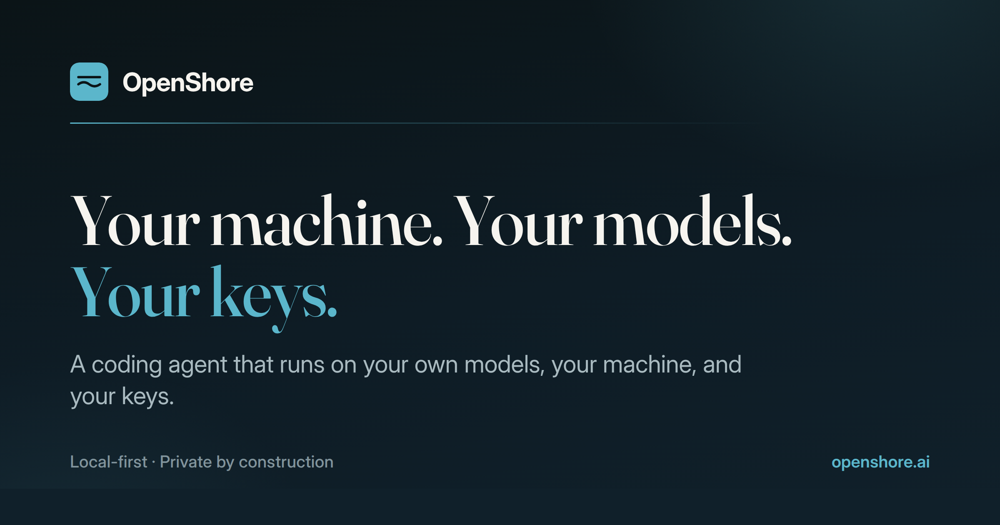

# OpenShore downloads

A coding agent that runs on your own models, your own machine, and your own
keys. Chat and build on Linux, macOS, and Windows today, with iPhone and iPad
next. Cloud models stay one deliberate tap away, always on your own account.

**Download the latest version at [openshore.ai](https://openshore.ai)**, or pick
a file from [Releases](https://github.com/openshore-labs/openshore-releases/releases).

| Platform | File |
| --- | --- |
| Linux | `.AppImage` or `.deb` |
| Windows | `OpenShore-Setup-<version>.exe` |
| Mac | `.dmg` (Apple silicon: the `arm64` file) |

The desktop app checks this repo for updates and offers each new version
itself, so you only download once.

This repo holds installers only. OpenShore's source code is private.

Made by [Open Shore Labs](https://github.com/openshore-labs).
